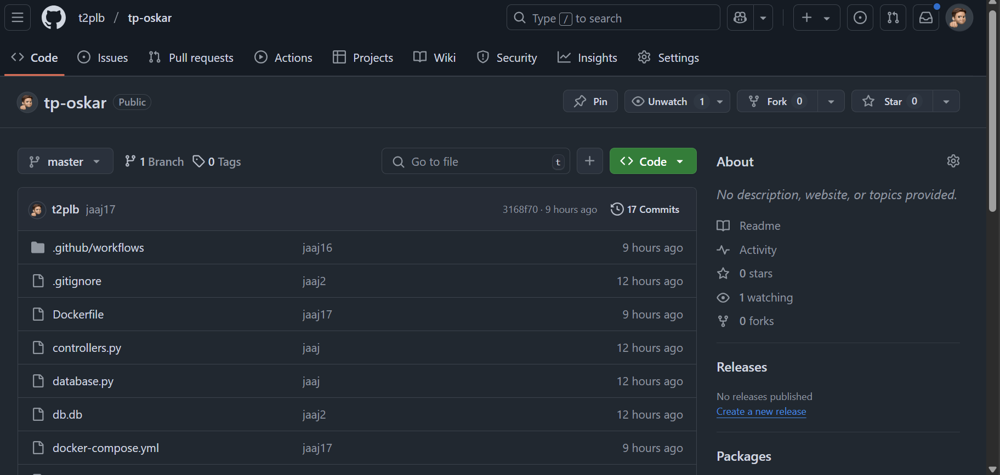
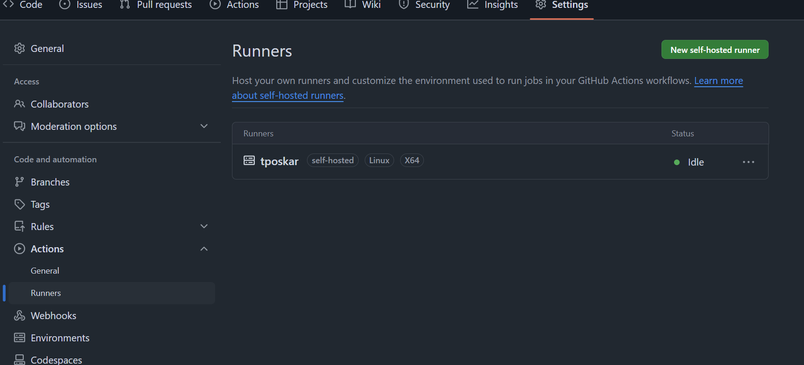
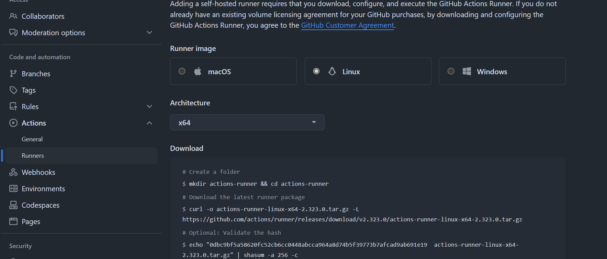
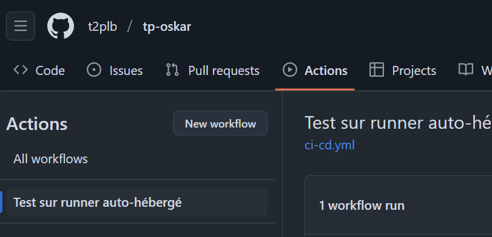

# Rapport Titouan Bonnet Plomb

## Installation & configuration

### VM

Nous allons utilisé le logiciel VMWare Workstation pour faire notre VM. 

Faite clique droit sur le menu de droite pour créer une nouvelle VM 

Laissez vous guider par l'assistant de création de VM

### Runner GitHub

Nous allons a présent installer le runner GitHub qui nous seras utilise pour tester et déployer notre application sur notre VM.

Pour ce faire rendez vous sur le repo qui contient votre code GitHub 

Rendez vous dans les parametres du repo et dans actions puis runners 

Faites "New self-hosted runner". Selectionner ensuite votre os (Linux) ainsi que votre architecture (x64) 

Vous avez ensuite plusieurs ligne de commande séparer en trois catégories :
- Download
- Configure

Executer les une pas une dans votre VM. Sauf pour les lignes présente dans le Configure, vous n'executerer que la première.

Nous allons maintenant faire un service de notre runner pour qu'il tourne en arrière plan.

Dans votre VM vous allez executer les commandes suivantes :

- ```shell ./svc.sh install ```
- ```shell ./svh.sh start ```

Dans l'ordre, ces commandes permettent d'installer le runner en tant que service et le démarrer.

### Docker

Une fois cela fais, nous allons installer docker. Si on suit la [documentation officielle Docker](https://docs.docker.com/engine/install/ubuntu/), il faut d'abord enregistrer les repos docker dans notre source de repo de package de la VM. Voici la commande donnée par la documentation :

```shell
# Add Docker's official GPG key:
sudo apt-get update
sudo apt-get install ca-certificates curl
sudo install -m 0755 -d /etc/apt/keyrings
sudo curl -fsSL https://download.docker.com/linux/ubuntu/gpg -o /etc/apt/keyrings/docker.asc
sudo chmod a+r /etc/apt/keyrings/docker.asc

# Add the repository to Apt sources:
echo \
  "deb [arch=$(dpkg --print-architecture) signed-by=/etc/apt/keyrings/docker.asc] https://download.docker.com/linux/ubuntu \
  $(. /etc/os-release && echo "${UBUNTU_CODENAME:-$VERSION_CODENAME}") stable" | \
  sudo tee /etc/apt/sources.list.d/docker.list > /dev/null
sudo apt-get update
```

Ensuite il faut installer via APT les différent packages de docker, comme le docker engine et le docker compose

```shell
sudo apt-get install docker-ce docker-ce-cli containerd.io docker-buildx-plugin docker-compose-plugin
```

Nous allons tester l'installation de notre docker engine avec la commande suivante

```shell
sudo docker run hello-world
```

Voici le resultat que vous devez obtenir 

## Optimisation.

Pour l'image du docker, j'ai utiliser une version slim de python 3.11 ce qui permet de passer d'une image de ~1Go à ~40Mo.

J'ai également tagguer mon image lors de la création de cette dernière pour eviter d'avoir à rebuild l'image à chaque fois dans mon conteneur docker.

## Réalisation

Nous allons maintenant créer un workflow qui va nous permettre d'utiliser notre VM comme runner. Voici le workflow créé : 

```yml
name: Test sur runner auto-hébergé

on:
  push:
    branches:
      - master

jobs:
  test:
    name: ci-cd on self hosted runner
    runs-on: self-hosted

    steps:
      - name: Checkout du code
        uses: actions/checkout@v4

      - name: Configurer Python
        uses: actions/setup-python@v4
        with:
          python-version: '3.11'

      - name: Installer les dépendances
        run: |
          python -m venv venv
          source venv/bin/activate
          pip install -r requirements.txt

      - name: Linter
        run: |
          source venv/bin/activate
          pylint --ignore=venv . | tee rapport_pylint.txt
      
      - name: Run test
        run: |
          source venv/bin/activate
          pytest ./test.py

      - name: Build image docker
        run: |
          sudo docker build -t tp-docker .
          sudo docker tag tp-docker tp-docker:latest
      
      - name: Docker compose
        run: |
          sudo docker compose up -d
      
      - name: check docker
        run: |
          sudo docker ps
```

### Explication du workflow

```yml
name: Test sur runner auto-hébergé

on:
  push:
    branches:
      - master
```

La balise name permet de donner un nom à notre Workflow qu'on verra apparaitre dans la Page Actions de github 
Cela permet de visualiser facilement les différents workflows si on en a plusieurs pour un projet

Ensuite les balises on, push, branches sont les triggers. Ici on active le workflow si un push sur la branche master est fait.

```yaml
jobs:
  test:
    name: ci-cd on self hosted runner
    runs-on: self-hosted

    steps:
      - name: Checkout du code
        uses: actions/checkout@v4

      - name: Configurer Python
        uses: actions/setup-python@v4
        with:
          python-version: '3.11'

      - name: Installer les dépendances
        run: |
          python -m venv venv
          source venv/bin/activate
          pip install -r requirements.txt

      - name: Linter
        run: |
          source venv/bin/activate
          pylint --ignore=venv . | tee rapport_pylint.txt
      
      - name: Run test
        run: |
          source venv/bin/activate
          pytest ./test.py

      - name: Build image docker
        run: |
          sudo docker build -t tp-docker .
          sudo docker tag tp-docker tp-docker:latest
      
      - name: Docker compose
        run: |
          sudo docker compose up -d
      
      - name: check docker
        run: |
          sudo docker ps
```

Ensuite dans le reste du workflow, on se décrit ce que fait notre workflow. Par exemple, on l'action qui s'appelle "Checkout du code" qui va se positionner sur la bonne branche du code, Ou bien l'action "Configurer Python" qui elle va s'occuper d'installer et de configurer Python.

Ensuite on continue dans notre Workflow à installer les dépendances, effecuter les test et les contenriser dans un conteneur Docker

A noter que la balise ```run``` permet d'executer une ou plusieurs ligne de commande (avec le pipe | ) dans notre runner.

Attention la commande doit être reconnu par l'OS. On pourra pas utiliser un script PS1 sur du Linux par exemple c'est donc important de bien choisir l'OS de son runner. Cependant la syntaxe pour les chemins de fichier reste bien formater comme pour Linux quelque soit l'OS du runner, c'est à dire :

```/path/to/file/``` et non pas ```C:\path\to\file``` Comme sur windows

Pour spécifier qu'on souhaite executer notre Workflows sur un runner self-hosted on specifie cette balise dans notre workflows

```yaml
runs-on: self-hosted
```

### Log CI/CD

Je met dans le mail des logs d'un job qui s'est executé avec succès

## Difficultés rencontrées

Je n'ai pas rencontré de diffculté particulière pour ce TP. Les workflows sont un outil avec lequel je suis à l'aise. La seule "difficulté" que j'ai rencontré serait pour le taggage de mes images docker. Je n'avais pas bien compris comment cela fonctionnait. Mais un petit tour sur la documentation officiel m'as permis de trouver comment faire.